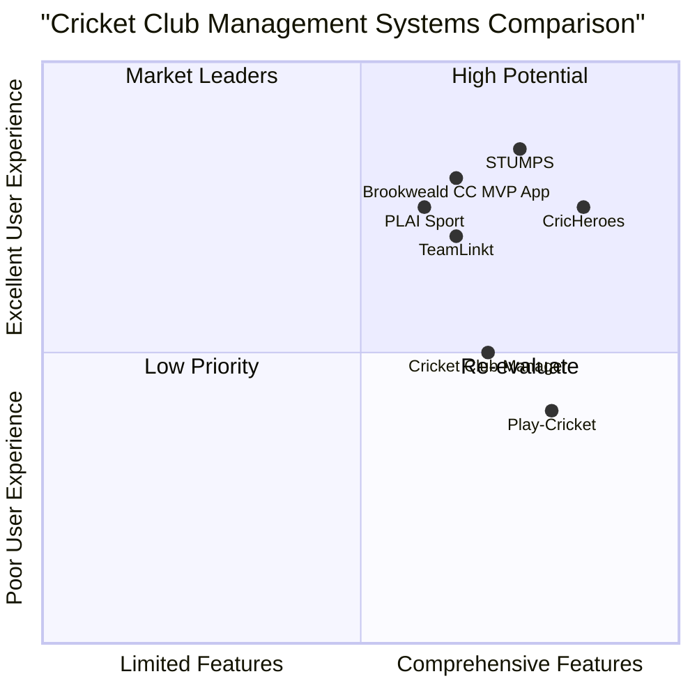

# Product Requirements Document: Brookweald CC MVP Leaderboard App

## 1. Product Overview

### 1.1 Project Information
- **Project Name**: brookweald_cc_mvp_leaderboard
- **Document Version**: 1.0
- **Last Updated**: July 27, 2025
- **Programming Languages**: React Native (mobile), TypeScript and Tailwind CSS (web)

### 1.2 Original Requirements
Create an MVP leaderboard app for a cricket club (Brookweald CC) that must be available as a responsive web platform and as a mobile app (iOS/Android). The app must allow admin users to input or upload match performance stats, then automatically calculate MVP points using a specified scoring system. It should support multiple user roles and work well on both desktop and mobile devices.

## 2. Product Definition

### 2.1 Product Goals
1. **Performance Tracking**: Create a comprehensive system for tracking individual and team cricket performance metrics and automatically calculating MVP points.
2. **Community Engagement**: Increase player and supporter engagement by providing transparent, real-time leaderboards and performance statistics.
3. **Administrative Efficiency**: Streamline the process of recording, calculating, and sharing cricket performance data for club administrators.

### 2.2 User Stories

#### Admin Users
- As an admin, I want to input match data and player performance stats so that the leaderboard stays current and accurate.
- As an admin, I want to upload batch statistics from spreadsheets so that I can efficiently update multiple matches at once.
- As an admin, I want to assign special designations like "Wally of the Week" so that I can maintain club traditions and culture.
- As an admin, I want to override automatically calculated statistics when necessary so that I can correct any errors.

#### Players
- As a player, I want to view my personal performance statistics so that I can track my progress over time.
- As a player, I want to see my position on the leaderboard so that I know how I compare to teammates.
- As a player, I want to filter statistics by time period or match type so that I can analyze specific aspects of my performance.

#### Public Viewers
- As a supporter, I want to view current team statistics so that I can stay informed about club performance.
- As a family member, I want to see player profiles so that I can follow specific players' achievements.

### 2.3 Competitive Analysis

#### CricHeroes
**Pros**:
- Comprehensive ball-by-ball scoring
- Large user base with community features
- Robust tournament management

**Cons**:
- Complex interface with steep learning curve
- Limited customization for club-specific scoring systems
- Paid features required for advanced analytics

#### Play-Cricket
**Pros**:
- Official ECB platform with wide adoption
- Strong statistical database
- League integration

**Cons**:
- Outdated user interface
- Limited mobile functionality
- Rigid scoring system

#### STUMPS
**Pros**:
- Modern, clean interface
- Strong analytical capabilities
- Good mobile experience

**Cons**:
- Limited free tier
- No custom MVP scoring system
- Limited export options

#### TeamLinkt
**Pros**:
- Strong team management features
- Good communication tools
- Multi-sport support

**Cons**:
- Cricket-specific features are limited
- Basic statistics only
- No custom scoring systems

#### PLAI Sport
**Pros**:
- Excellent logistics management
- Team selection tools
- Good brand building capabilities

**Cons**:
- Limited scoring features
- No dedicated cricket statistics
- No leaderboard functionality

#### Cricket Club Manager
**Pros**:
- Purpose-built for cricket clubs
- Good membership management
- Financial tools included

**Cons**:
- Basic match statistics only
- Limited mobile experience
- No custom MVP system

#### Brookweald CC MVP App (Target)
**Pros**:
- Custom MVP scoring system specifically for club needs
- Balanced web and mobile experience
- Focused on club engagement through leaderboards
- Export functionality for further analysis
- Multiple user roles with appropriate permissions

**Cons**:
- New platform without established user base
- Initially limited to single club usage
- Fewer features than comprehensive commercial platforms

### 2.4 Competitive Quadrant Chart



## 3. Technical Specifications

### 3.1 Requirements Analysis

The Brookweald CC MVP Leaderboard application requires both a responsive web platform and mobile applications for iOS and Android. The application must handle player and match data, calculate MVP points based on performance, display statistics in various formats, and support multiple user roles with different access levels.

Key technical components include:
- User authentication and authorization system
- Database for storing player profiles, match details, and performance statistics
- Calculation engine for MVP point determination
- Data import/export functionality
- Responsive user interfaces for web and mobile platforms
- Admin tools for data management and override capabilities

The scoring system is clearly defined with specific point allocations for batting, bowling, fielding achievements, and team results. The application must accurately implement these calculations while providing flexibility for administrators to make adjustments.

### 3.2 Requirements Pool

#### P0 (Must-have)
1. **User Authentication & Authorization**
   - Login system with multiple user roles (admin, player, public)
   - Role-based access controls

2. **Match Entry**
   - Create new matches with date, opponent, team selection, and result
   - Edit existing match details
   - Mark matches as complete/incomplete

3. **Player Performance Entry**
   - Record batting statistics (runs, boundaries, milestones)
   - Record bowling figures (wickets, maiden overs)
   - Record fielding statistics (catches, stumpings, run-outs)
   - Record team results and special designations

4. **MVP Point Calculation**
   - Automatically calculate points based on defined scoring system
   - Update leaderboard in real-time when new data is entered
   - Display point breakdown for individual performances

5. **Leaderboard Views**
   - Overall season leaderboard
   - Filter by match, season, or player
   - Sort by different statistical categories
   - Mobile-responsive design

6. **Player Profiles**
   - Individual statistics page for each player
   - Performance history and trends
   - Current season summary

7. **Admin Controls**
   - Override capability for statistics and points
   - Assign special designations like "Wally of the Week"
   - Manage player roster and user accounts

8. **Data Export**
   - Export statistics to CSV format

#### P1 (Should-have)
9. **Batch Import**
   - Upload multiple match statistics via spreadsheet

10. **Advanced Filtering**
    - Filter by multiple criteria simultaneously
    - Save favorite filters

11. **Performance Comparison**
    - Compare statistics between players
    - Compare player performance across seasons

12. **Match Scorecards**
    - Detailed view of complete match statistics
    - Team and individual performance summaries

13. **Statistical Visualizations**
    - Charts and graphs of performance trends
    - Visual representation of leaderboard positions

#### P2 (Nice-to-have)
14. **Notifications**
    - Alert players to updated statistics
    - Notify about leaderboard position changes

15. **Social Sharing**
    - Share achievements to social media platforms
    - Embed leaderboards on external websites

16. **Advanced Analytics**
    - Predictive performance metrics
    - Opposition player analysis

17. **Offline Functionality**
    - Limited app functionality without internet connection
    - Data synchronization when connection restored

18. **API Access**
    - External access to statistics for third-party use
    - Integration with other cricket platforms

### 3.3 UI Design Draft

#### 3.3.1 Web Platform Layout
The web platform will feature a responsive design with the following key screens:

**Dashboard/Home**
- Current season leaderboard (top 5)
- Recent match results
- Quick access to player search and filtering options
- Announcements and club updates

**Full Leaderboard**
- Sortable table of all players and their MVP points
- Filter controls (by season, match, date range)
- Search functionality
- Export button for administrators

**Player Profile**
- Player details and photo
- Current season statistics summary
- Historical performance graph
- Detailed breakdown of points earned
- Match-by-match performance table

**Match Entry (Admin)**
- Form for match details (date, opponent, venue)
- Team selection interface
- Tabbed interface for batting, bowling, and fielding statistics
- Auto-calculation display showing MVP points in real-time

**Administration Panel**
- User management interface
- Data override controls
- System configuration options
- Import/export functionality

#### 3.3.2 Mobile App Layout
The mobile app will maintain core functionality while optimizing for smaller screens:

**Home Tab**
- Current season leaderboard (scrollable)
- Recent match results
- Quick filters

**Player Tab**
- Search functionality
- Alphabetical list of players
- Quick access to user's own profile (for logged-in players)

**Profile View**
- Condensed player statistics
- Swipeable tabs for different stat categories
- Performance graph (simplified for mobile)

**Entry Form (Admin)**
- Simplified match entry interface
- Step-by-step flow for adding performance data
- Mobile-optimized input controls

### 3.4 Open Questions

1. **Data Migration**: How will historical statistics (if any) be migrated into the new system?

2. **Access Control Levels**: Are there additional permission levels needed beyond admin, player, and public viewer?

3. **Offline Usage Requirements**: What specific offline capabilities are needed for the mobile application?

4. **Score Verification**: Should the system require secondary verification of entered statistics before publishing to the leaderboard?

5. **Development Priority**: Should mobile or web platform be prioritized for initial release?

6. **Performance Requirements**: What are the expected number of concurrent users and response time requirements?

7. **Data Retention**: Are there specific requirements for how long historical data should be maintained?

## 4. User Personas

### 4.1 Admin User - "Organized Oliver"
- **Role**: Club Secretary/Team Manager
- **Age**: 35-55
- **Technical Proficiency**: Moderate
- **Goals**: 
  - Keep accurate records of team and player performance
  - Save time on administrative tasks
  - Engage club members through statistics and recognition
- **Frustrations**:
  - Manual calculation is time-consuming and error-prone
  - Difficult to share statistics with all club members
  - Limited time to input detailed match information
- **Needs**:
  - Easy-to-use input forms
  - Bulk upload capability
  - Quick override and correction tools

### 4.2 Player - "Competitive Chris"
- **Role**: Regular Team Player
- **Age**: 18-45
- **Technical Proficiency**: High
- **Goals**:
  - Track personal performance
  - Compare statistics with teammates
  - Improve game based on statistical feedback
- **Frustrations**:
  - Lack of transparency in performance tracking
  - Delayed updates to statistics
  - Limited access to personal historical data
- **Needs**:
  - Real-time updates to the leaderboard
  - Detailed personal statistics
  - Comparison tools

### 4.3 Public Viewer - "Supportive Sam"
- **Role**: Club Supporter/Family Member
- **Age**: Variable
- **Technical Proficiency**: Low to Moderate
- **Goals**:
  - Follow club and specific player performance
  - Stay connected to club activities
  - Access match results easily
- **Frustrations**:
  - Difficulty finding relevant information
  - Overly complex statistical presentations
  - Limited mobile access to information
- **Needs**:
  - Simple, clean interface
  - Basic filtering options
  - Mobile-friendly design

### 4.4 Junior Player - "Young Yasmin"
- **Role**: Youth Team Member
- **Age**: 12-17
- **Technical Proficiency**: High
- **Goals**:
  - Track improvement over time
  - Compare with peers
  - Share achievements with family and friends
- **Frustrations**:
  - Complex statistics that are hard to understand
  - Difficulty accessing information on mobile devices
  - Limited recognition of achievements
- **Needs**:
  - Engaging, simple interface
  - Achievement highlights
  - Easy sharing options

## 5. Functional Requirements

### 5.1 Authentication and User Management

1. **User Registration**
   - The system must allow new users to register with email or social login
   - Registration must capture essential user information (name, email, role request)
   - Admin approval required for elevated access levels

2. **Login System**
   - Secure login with password requirements
   - Remember me functionality
   - Password reset capability
   - Session management with appropriate timeout

3. **User Roles and Permissions**
   - Admin: Full access to all features and data entry
   - Player: Access to view all statistics, detailed access to personal statistics
   - Public: Limited access to leaderboards and basic statistics

### 5.2 Match and Performance Data Management

1. **Match Creation**
   - Form for entering match details (date, opponent, venue, format)
   - Team selection from player roster
   - Match result recording
   - Match status tracking (scheduled, in progress, completed)

2. **Performance Data Entry**
   - Batting statistics entry (runs, balls faced, boundaries, dismissal type)
   - Bowling statistics entry (overs, maidens, runs conceded, wickets)
   - Fielding statistics entry (catches, stumpings, run-outs, dropped catches)
   - Validation to ensure data consistency and accuracy

3. **Data Import/Export**
   - CSV template for batch importing match data
   - CSV export of filtered leaderboard data
   - Export of individual player statistics

### 5.3 MVP Point Calculation

1. **Batting Points**
   - +1 point per run scored
   - +4 additional points for each boundary four
   - +6 additional points for each boundary six
   - +25 bonus points for scoring 50 runs
   - +50 bonus points for scoring 100 runs
   - -15 penalty points for a duck (zero runs)

2. **Bowling Points**
   - +25 points per wicket taken
   - +5 bonus points for a 3-wicket haul
   - +75 total bonus points for a 5-wicket haul (not +75 additional)
   - +10 points per maiden over bowled

3. **Fielding Points**
   - +10 points per catch taken
   - +10 points per stumping completed
   - +20 points per direct-hit run-out
   - +10 points per assisted run-out
   - -10 penalty points per dropped catch

4. **Team and Special Points**
   - +3 points per player on the winning team
   - -3 penalty points for "Wally of the Week" designation

5. **Override Capability**
   - Admin interface for manual adjustment of calculated points
   - Audit log of manual adjustments made

### 5.4 Leaderboard and Statistics Display

1. **Leaderboard Views**
   - Overall leaderboard showing all players ranked by MVP points
   - Filtering capability by date range, season, match, and player
   - Sortable columns for different statistical categories
   - Search functionality to locate specific players

2. **Player Profiles**
   - Dedicated page for each player's statistics
   - Current season summary statistics
   - Historical performance data and trends
   - Match-by-match breakdown of performance and points

3. **Statistical Visualizations**
   - Line graphs for performance trends over time
   - Bar charts comparing key statistics
   - Visual representation of point contributions by category

### 5.5 Administration Tools

1. **User Management**
   - Create, edit, and deactivate user accounts
   - Assign and modify user roles
   - Reset user passwords

2. **Data Management**
   - Edit or delete erroneous match data
   - Override automatically calculated statistics
   - Assign special designations (e.g., "Wally of the Week")

3. **System Configuration**
   - Customize point calculation parameters (if needed)
   - Define seasons and competitions
   - Set default views and filters

## 6. Non-Functional Requirements

### 6.1 Performance

1. **Response Time**
   - Web page loading time must not exceed 2 seconds
   - Data entry forms must save within 1 second
   - Leaderboard calculations must update within 3 seconds of data entry

2. **Scalability**
   - System must support up to 500 registered users
   - Database must efficiently handle up to 10 years of match history
   - Concurrent user support for at least 50 users

### 6.2 Usability

1. **Accessibility**
   - Web application must conform to WCAG 2.1 AA standards
   - Mobile application must follow platform accessibility guidelines
   - Color schemes must consider color-blind users

2. **Responsiveness**
   - Web interface must be fully functional on screens from 320px to 2560px width
   - Touch-friendly controls for mobile and tablet users
   - Consistent experience across device types

3. **Learnability**
   - New admin users should be able to enter a complete match within 10 minutes without training
   - Tooltips and help text for complex functions
   - Inline validation and error messages

### 6.3 Reliability

1. **Availability**
   - System should maintain 99.5% uptime during cricket season
   - Scheduled maintenance windows communicated in advance
   - Graceful degradation during connectivity issues

2. **Data Integrity**
   - Regular automated backups of all data
   - Validation rules to prevent incorrect data entry
   - Audit trails for all data modifications

### 6.4 Security

1. **Data Protection**
   - Encryption of sensitive user data
   - Compliance with relevant data protection regulations
   - Secure transmission of all data (HTTPS)

2. **Access Control**
   - Role-based access control for all functions
   - Session timeout after 30 minutes of inactivity
   - Login attempt limitations to prevent brute force attacks

### 6.5 Compatibility

1. **Browser Support**
   - Full functionality in current and previous major versions of Chrome, Firefox, Safari, and Edge
   - Graceful degradation in older browsers
   - No dependency on browser plugins

2. **Mobile Platform Support**
   - Native applications for iOS 14+ and Android 10+
   - Responsive web version accessible on mobile browsers

## 7. Implementation Approach

### 7.1 Technology Stack

#### Web Platform
- **Frontend**: React.js with TypeScript, Tailwind CSS
- **Backend**: Node.js with Express
- **Database**: MongoDB for flexible schema evolution

#### Mobile Applications
- **Framework**: React Native for cross-platform development
- **Navigation**: React Navigation
- **UI Components**: Native Base

#### Shared Infrastructure
- **Authentication**: Firebase Authentication
- **Cloud Functions**: Firebase Cloud Functions for shared business logic
- **Storage**: Firebase Cloud Storage for media files
- **Hosting**: Firebase Hosting for web application

### 7.2 Development Phases

#### Phase 1: Core Functionality (8 weeks)
- User authentication system
- Basic data models and database structure
- Match entry and MVP calculation logic
- Simple leaderboard view
- Player profile pages
- Admin override capabilities

#### Phase 2: Enhanced Features (6 weeks)
- Mobile application development
- Advanced filtering and search
- Data import/export functionality
- Statistical visualizations
- Improved UI/UX based on initial feedback

#### Phase 3: Refinement (4 weeks)
- Performance optimization
- Additional nice-to-have features
- Bug fixes and usability improvements
- Final testing and deployment preparation

### 7.3 Testing Strategy

- **Unit Testing**: Core calculation functions and data transformations
- **Integration Testing**: API endpoints and data flow
- **User Acceptance Testing**: With club administrators and selected players
- **Compatibility Testing**: Across supported browsers and devices
- **Performance Testing**: Under expected load conditions

## 8. Success Metrics

### 8.1 Adoption Metrics
- 90% of active club players registered within first month
- 70% of players accessing the platform at least weekly during cricket season
- Admin time spent on statistics reduced by 75% compared to previous method

### 8.2 Engagement Metrics
- Average session duration of 5+ minutes
- Leaderboard viewed at least 3 times per week per registered player
- 50% of players accessing their personal statistics page weekly

### 8.3 Technical Metrics
- 99.5% uptime during cricket season
- Average page load time under 2 seconds
- Zero critical data integrity issues

## 9. Appendices

### 9.1 Glossary of Cricket Terms

- **Duck**: Dismissed for zero runs
- **Maiden Over**: An over (6 balls) in which no runs are scored
- **Wicket**: Dismissal of a batsman
- **Stumping**: Dismissal where wicketkeeper removes bails when batsman is out of crease
- **Run-Out**: Dismissal where fielders hit wickets with ball before batsman completes run
- **Boundary**: When the ball reaches or crosses the perimeter of the field (4 or 6 runs)
- **Innings**: One team's turn to bat
- **MVP**: Most Valuable Player

### 9.2 Sample Wireframes

The following wireframes illustrate key screens of the application:

[Note: In a full PRD, detailed wireframe images would be included here]

#### Web Dashboard
```
+--------------------------------------------------------------+
|                     BROOKWEALD CC MVP                [Login] |
+--------------------------------------------------------------+
| [Dashboard] [Leaderboard] [Players] [Matches]   [Admin Menu] |
+--------------------------------------------------------------+
|                                                              |
|  SEASON LEADERBOARD (Top 5)        | RECENT MATCHES          |
|  -------------------------         | ---------------         |
|  1. Player Name       245 pts      | vs Opponent CC          |
|  2. Player Name       230 pts      | July 24, 2025           |
|  3. Player Name       215 pts      | Won by 5 wickets        |
|  4. Player Name       190 pts      |                         |
|  5. Player Name       185 pts      | vs Another CC           |
|                                    | July 17, 2025           |
|  [View Full Leaderboard]           | Lost by 30 runs         |
|                                    |                         |
|                                    | [View All Matches]      |
|                                                              |
|  PERFORMANCE HIGHLIGHTS            | CLUB ANNOUNCEMENTS      |
|  ----------------------            | ------------------      |
|  • Player achieved 5-wicket haul   | • Next match: July 31   |
|  • Player scored century           | • Annual dinner: Aug 15 |
|  • Player took 3 catches           | • Training: Wednesdays  |
|                                    |                         |
+--------------------------------------------------------------+
```

#### Mobile Leaderboard View
```
+-------------------------+
| BROOKWEALD CC MVP    ☰ |
+-------------------------+
| [Home] [Board] [Profile]|
+-------------------------+
|                         |
| LEADERBOARD             |
|                         |
| Filter by: [Season ▼]   |
|                         |
| 1. Player Name          |
|    245 pts              |
|    [Batting] [Bowling]  |
|                         |
| 2. Player Name          |
|    230 pts              |
|    [Batting] [Bowling]  |
|                         |
| 3. Player Name          |
|    215 pts              |
|    [Batting] [Bowling]  |
|                         |
| 4. Player Name          |
|    190 pts              |
|    [Batting] [Bowling]  |
|                         |
| 5. Player Name          |
|    185 pts              |
|    [Batting] [Bowling]  |
|                         |
+-------------------------+
```

#### Match Entry Form (Admin)
```
+--------------------------------------------------------------+
|                     BROOKWEALD CC MVP               [Logout] |
+--------------------------------------------------------------+
| [Dashboard] [Leaderboard] [Players] [Matches]   [Admin Menu] |
+--------------------------------------------------------------+
|                                                              |
|  NEW MATCH ENTRY                                             |
|  --------------                                              |
|                                                              |
|  Date: [Date Picker       ] Opponent: [_____________]        |
|                                                              |
|  Venue: [____________]          Result: [Won ▼]              |
|                                                              |
|  [Batting] [Bowling] [Fielding] [Summary]                    |
|  -------------------------------------------------           |
|                                                              |
|  BATTING SCORECARD                                           |
|                                                              |
|  Player      | Runs | Balls | 4s | 6s | How Out    | Bowler  |
|  ------------|------|-------|----|----|-----------|---------|
|  [Player ▼]  | [__] | [__]  | [] | [] | [Not Out▼]|[______]|
|  [Player ▼]  | [__] | [__]  | [] | [] | [Not Out▼]|[______]|
|  [Player ▼]  | [__] | [__]  | [] | [] | [Not Out▼]|[______]|
|  [ + Add Player ]                                            |
|                                                              |
|  Team Total: 0/0                 Overs: 0.0                  |
|                                                              |
|  [Previous]                                      [Next >]    |
|                                                              |
+--------------------------------------------------------------+
```

### 9.3 MVP Point Calculation Examples

**Example 1: Batting Performance**
- Player scores 63 runs with 5 fours and 2 sixes
- Points calculation:
  * Base runs: 63 points
  * Boundaries: 5 fours × 4 = 20 points
  * Sixes: 2 sixes × 6 = 12 points
  * Fifty bonus: 25 points
  * Total batting points: 120 points

**Example 2: Bowling Performance**
- Player takes 3 wickets with 1 maiden over
- Points calculation:
  * Wickets: 3 wickets × 25 = 75 points
  * 3-wicket bonus: 5 points
  * Maiden over: 1 × 10 = 10 points
  * Total bowling points: 90 points

**Example 3: Fielding Performance**
- Player takes 2 catches, 1 direct-hit run-out, and drops 1 catch
- Points calculation:
  * Catches: 2 × 10 = 20 points
  * Direct-hit run-out: 1 × 20 = 20 points
  * Dropped catch: 1 × (-10) = -10 points
  * Total fielding points: 30 points

**Example 4: Full Match Performance**
- Player from winning team scores 35 runs with 3 fours, takes 1 wicket, and 1 catch
- Points calculation:
  * Batting: 35 + (3 × 4) = 47 points
  * Bowling: 1 × 25 = 25 points
  * Fielding: 1 × 10 = 10 points
  * Team win bonus: 3 points
  * Total match points: 85 points